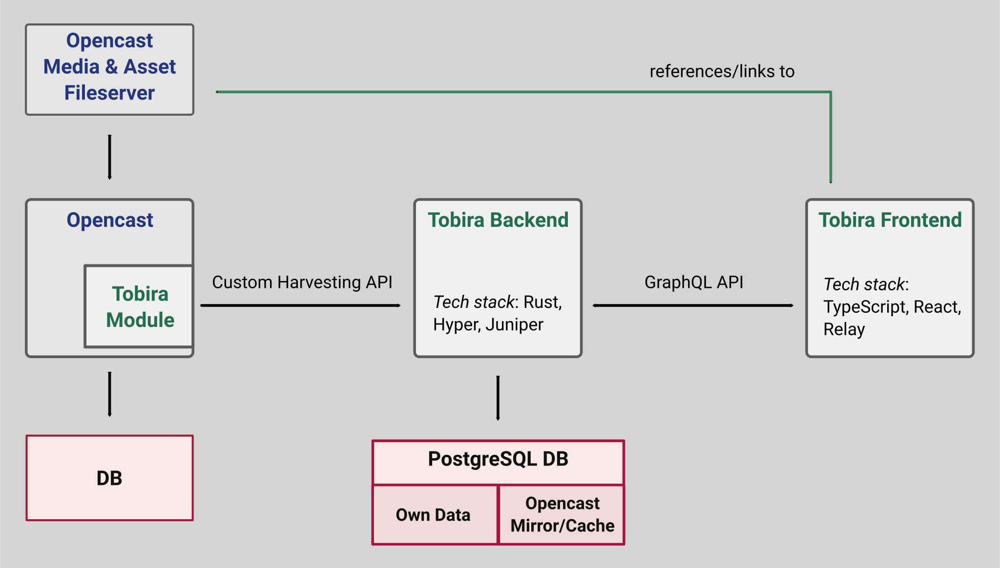

# High level overview

## Architecture

Tobira runs separately from Opencast and does not directly use Opencast's APIs to obtain information about events and series.
It maintains a copy of all relevant Opencast data, except attachments and media, in its own database.
This has some advantages:

- Tobira can still run when Opencast is down.
  Of course, this requires a web server on the Opencast presentation node still delivering attachments and media files.
- Tobira can use its own GraphQL API which can provide data for the frontend a lot faster than multiple queries to the Opencast APIs could.
  This makes using Tobira a lot more snappy.
- Letting the Tobira frontend directly talk to Opencast would require setting up CORS on the Opencast node or rerouting all requests through the Tobira backend.

This is an overview over the Tobira architecture:

## Communication with Opencast

To synchronize data between Opencast and Tobira, unfortunately, a new Opencast API had to be added.
This is implemented in the `tobira` Opencast module, which is being developed [in this repository](https://github.com/elan-ev/opencast-tobira/).
That module currently provides the `/tobira/harvest` API.
It takes two GET parameters: `since` (timestamp) and `preferredAmount`.
The `since` parameter allows to filter by events/series that have been modified after a given timestamp, thus allowing Tobira to incrementally get updates without refetching all data.
Tobira itself maintains a `harvestedEverythingUntil` timestamp in its database.

Currently, Tobira polls this API regularly.
While this single call to the API is very low cost, a "push" style of communication would of course be preferred over polling.
We will most certainly add additional ways for Tobira and Opencast to communicate to allow for low-delay data updates and more.
The whole OC-Tobira communication topic is still being figured out and will change in the future.
