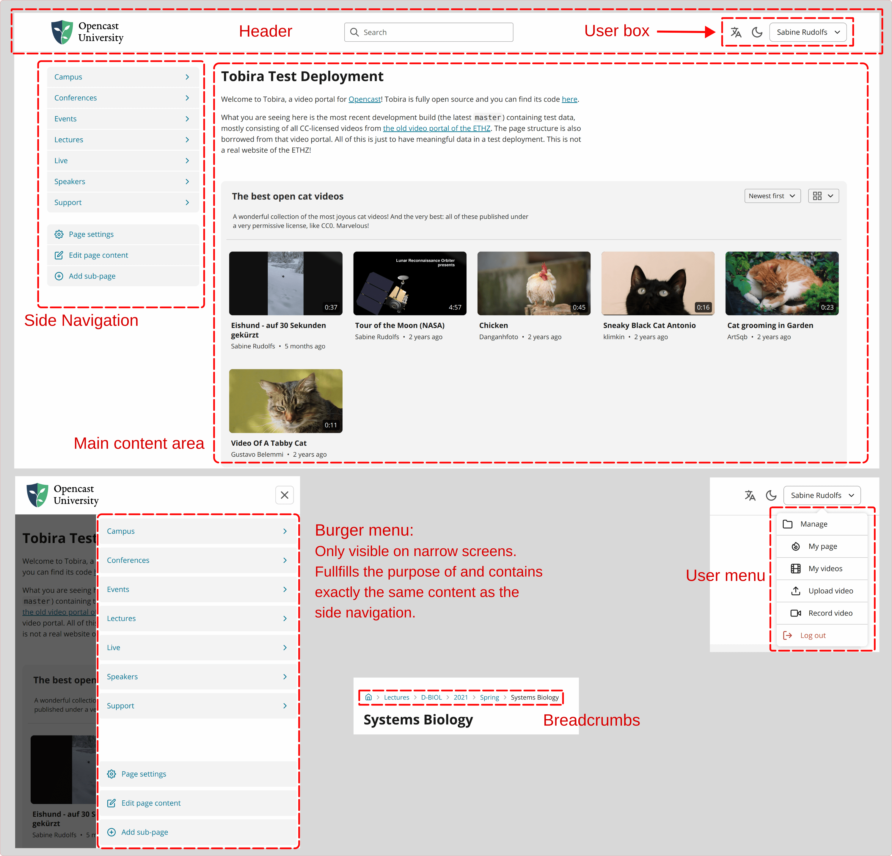

# Semantics and definitions

This document is a loose collection of various additional information, defining some terms and explaining how some details of Tobira work.
This hopefully enables more precise communication in Tobira-related discussions.

## Common UI elements

## Content Pages

Tobira contains a hierarchy of *content pages*, collectively also called the *page tree*.
There is one root *content page* (also called home page or start page), which is the first thing you see when visiting Tobira.
Each *content page* can have sub-*content pages*, which moderators can add and remove.
Each *content page* has a name (which is shown at the very top) and contains an ordered list of "content blocks".
Currently, there are title blocks, text blocks, series blocks and video blocks.

In Tobira's user-facing UI, *content pages* are simply called "pages".
But as "page" is a very generic term, this document will use the term *content page* to specifically refer to these user-editable pages described in this section.

In addition to this main page tree, each user (who is allowed to) can create and manage their own page tree.
These *content pages* are called "user pages".
User pages (and the content placed there) do not appear in the search or anywhere in the main page tree; one has to know the username or link to a user page in order to visit it.
(Content that also appears on public pages, will also appear in the search.)

## Routes

Different routes exist in Tobira to access *content pages*, videos, the management section, or other features of Tobira.
The values `in this style` are the URL paths, e.g. what the browser will show after your domain (e.g. `tobira.my-university.de`) when visiting that route.

- **Main content pages**: `/<path/to/page>`.
  Shows a *content page* in the page tree.
  There are certain limitations on the path segments that can be used here in order to not collide with the routes defined below.
  Examples:
    - `/` (*home page*)
    - `/conferences`
    - `/lectures/biology/2023`

- **User pages**: `/@<userid>/<path/to/page>`.
  Shows a user page.
  They always start with `/@` and then the user ID of the owning user.
  Examples:
    - `/@peter` (user *root* page)
    - `/@peter/math-explanations`

- **Videos in context**: `/<path/to/page>/v/<videoid>`.
  Shows a video with *page context* (meaning: a video or its series is included on a *content page*).
  The navigation of that *content page* is shown.
  If the video’s series is included on a *content page*, you get to this page when clicking on the video's thumbnail.
  Also works for user pages.
  Examples:
    - `/lectures/biology/2023/v/L5CUekz9uQ0`
    - `/v/ENIGYvfETox`
    - `/@peter/dance-lessons/v/HFl9DghSw4x`

- **Video direct links**: `/!v/<videoid>` or `/!v/:<oc_id>`.
  Shows a video without *page context*.
  The home page navigation is shown.
  Useful when the video is not included in any *content page* yet, or if you want to generate a link from an Opencast ID.
  Examples:
    - `/!v/L5CUekz9uQ0`
    - `/!v/:25e82f02-db10-4ba6-937f-3252353cfbe8`

- **Series direct links**: `/!s/<seriesid>` or `/!s/:<oc_id>`. Exactly like video direct links, but for series.

- **Management routes**: `/~manage/<...>` and `/~upload`. For various "management" pages, like "my videos" or modifying a *content page*.

- **Other internal routes**: `/~<...>`, e.g. `/~about`.

## "Listed" and being findable via search

User pages *cannot* be found via search.
Non-user content pages *can* be found via search.
For videos and series, it gets more complicated.

The findability for both depends on whether they are included in a *content page*.
Included means that a content block (the things you can put on a *content page*) refers to them.
A video is "included in a content page" if that content page has a video block with that video, or a series block with that video's series.
Similarly, a series is included in a content page, if a series block refers to it or if a video block refers to any of its videos.

If and only if a video/series is included in any non-user content page, it is findable via search.
(Note: currently, series are not findable via search at all, but simply because it was not implemented yet. The described rules will be used in the future.)
